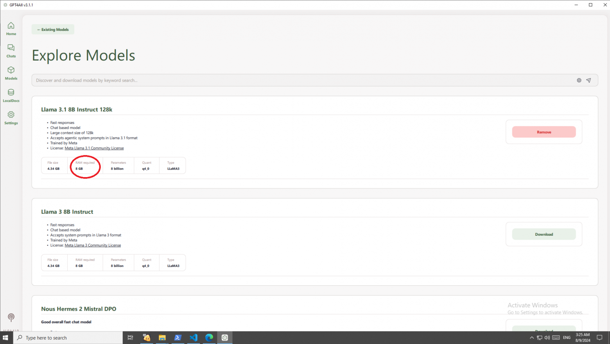
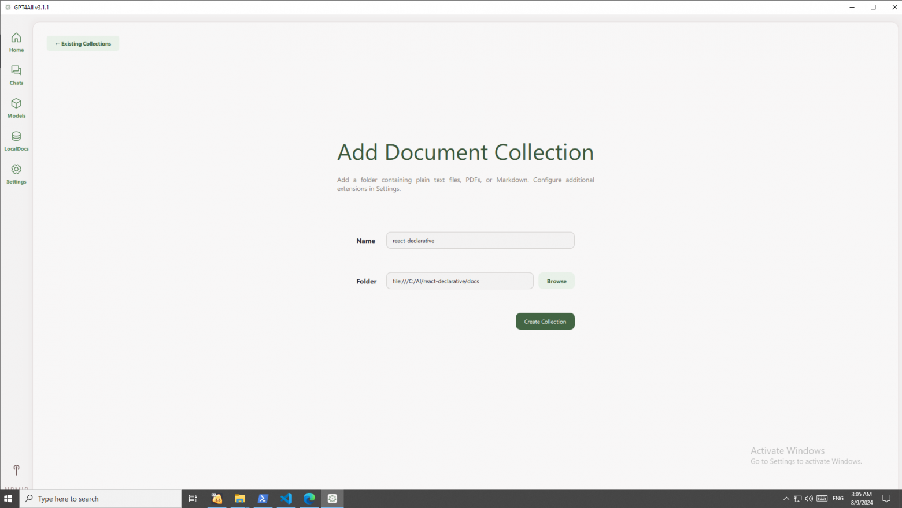
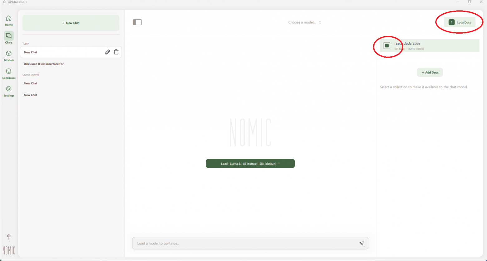

# Ask AI for Everything

> Using nomic-embeded-text, we can create a knowledge base for text models like LLama.

In this article, I will show you how to create a standard Q&A knowledge base for automating the onboarding of junior developers. No console, no Anaconda, no Docker, no CUDA drivers—everything is set up through a GUI with Setup.exe.

**Step 1: Download and Set Up GPT4All** 

> Download link: [https://www.nomic.ai/gpt4all](https://www.nomic.ai/gpt4all) 


GPT4All is llama.cpp + Qt6. Qt allows for creating a user interface, while llama.cpp lets you run neural networks in GGUF format without Python, avoiding many issues that arise with a special Python version (Python 3.7 for TensorFlow) and Anaconda (which can bloat your hard drive with 10 gigabytes of .whl packages). Since it is a binary, all dependencies are frozen, and the language model won't stop working with new Windows updates.


Open the config file and add a line to run language models on the CPU. This eliminates the dependency of the language model on the graphics card's RAM.


If your graphics card has more than 8GB of RAM, this step is unnecessary. The corporate sector operates on laptops, which have graphics cards with reduced memory. In other words, if your laptop has an RTX 4050 sticker, the neural network might fail because it allocates 8GB of GPU memory.


Download the neural network. Choose any available one; they are sorted by likes. But remember about GPU memory: with the CPU flag enabled, any neural network will work, but on GPU, you need MORE than stated, as part of the GPU memory is used by Windows itself. If it says 8GB, you need a card with 12GB.



Clone the repository with documentation. GPT4All can process Markdown files, like README.md files on GitHub, *.md files, with preview available in VS Code. If needed, you can look it up on YouTube or use any WYSIWYG Markdown editor. Notably, there's a Chrome browser extension, ChatGPT to Markdown, which allows you to generate documentation from code in ChatGPT for free. Alternatively, JetBrains AI is suitable; a WebStorm trial should be enough to cover the entire project documentation, but you’ll need to pay $10 for the AI plugin.


```bash
git clone https://github.com/react-declarative/react-declarative.git
```

Choose the folder with the documentation. Click Create Collection.



**Step 2: Start the Chat and Write a Prompt** 

Create a chat, select the neural network, and connect the documentation by clicking the LocalDocs button in the upper right corner and checking the checkbox.



Write your prompt. In the case of react-declarative, I wrote the following:

```text
write a sample sign in form by using IField interface
```


Enjoy the code generation based on the documentation.

Thank you for your attention!
